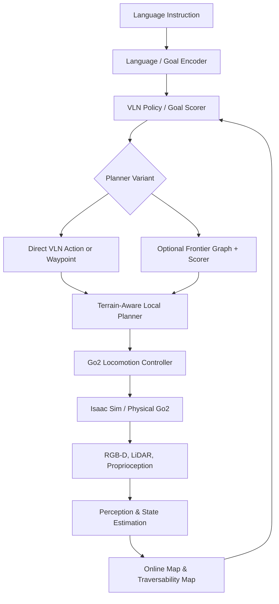

# VLN-Based Unknown and Unstructured Environment Exploration with Unitree Go2

> **석사학위 연구 프로젝트 — 김무정**  
> 경북대학교 물·IT융합공학과  
> Physical Intelligence Laboratory (PILAB), 지도교수: 이상문 교수

## 1. Project Overview

This project investigates **Vision-Language Navigation (VLN)** for autonomous exploration of unknown and unstructured environments using the **Unitree Go2 quadruped robot**.

The primary goal is to build and evaluate a simulation framework in **NVIDIA Isaac Sim** in which Go2 understands a natural-language instruction, perceives an unseen environment, selects safe and semantically meaningful routes, and traverses terrain that is difficult for conventional wheeled robots. If the simulation reaches sufficient reliability within the thesis schedule, the final stage will transfer the policy to the physical Go2 platform through a **Sim-to-Real** pipeline.

VLN is the central research topic. A frontier graph or frontier-scoring module may be used as an optional planning component, but it is not assumed to be mandatory.

## 2. Research Question

> How can a quadruped robot use visual observations and natural-language instructions to explore an unknown, unstructured environment while maintaining semantic goal alignment, navigation efficiency, and terrain safety?

The project focuses on three coupled problems:

1. **Language-conditioned exploration** — interpreting instructions such as “inspect the area beyond the downhill passage” or “find the red object near the rubble.”
2. **Unknown-space navigation** — continuously updating the map and choosing the next informative or goal-relevant region.
3. **Terrain-aware locomotion and safety** — traversing slopes and uneven ground while avoiding collisions and unsafe terrain.

## 3. Target Capabilities

The target system should support:

- VLN-based instruction following in previously unseen environments
- Online mapping and localization
- Exploration of unknown free space
- Semantic target and region understanding
- Collision and obstacle avoidance
- Traversal of uneven terrain and cluttered passages
- Ascending and descending slopes
- Traversability and foothold-risk assessment
- Recovery or replanning after navigation failure
- Quantitative evaluation in Isaac Sim
- Optional deployment to a physical Unitree Go2

> The exact obstacle categories and terrain limits will be defined as measurable benchmark conditions during implementation rather than claimed in advance.

## 4. Proposed System Architecture

### Core modules

- **Multimodal perception:** RGB-D and/or LiDAR features, robot pose, terrain geometry, and semantic cues
- **Language grounding:** converts the instruction into goal- or region-conditioned features
- **VLN policy:** predicts a navigation action, subgoal, or waypoint from language and observation history
- **Mapping:** maintains an occupancy, elevation, voxel, or semantic map for unknown-space reasoning
- **Traversability estimation:** evaluates slope, roughness, clearance, collision risk, and feasible motion
- **Local planning/control:** converts the selected subgoal into safe quadruped motion
- **Failure recovery:** detects blocked routes, unsafe slopes, localization errors, or stalled progress and triggers replanning

## 5. Frontier Planning: Optional Research Variant

The thesis will compare two design directions where feasible.

### Variant A — End-to-End / Hierarchical VLN

The VLN model directly predicts actions or intermediate waypoints from language, perception, and navigation history.

### Variant B — VLN with Frontier Graph

The system constructs an online frontier graph from the currently observed map. Each candidate frontier (f_i) is ranked using language relevance, expected information gain, travel cost, and terrain risk:

[
S(f_i)=
w_l S_{	ext{lang}}(f_i)
+w_i I(f_i)
-w_c C(f_i)
-w_r R(f_i)
]

where:

- (S_{	ext{lang}}): relevance to the language instruction
- (I): expected information gain
- (C): path or energy cost
- (R): terrain and collision risk

A Mamba/SSM-style scorer may be investigated for modeling the ordered history of observations and frontier candidates. This builds on the laboratory's prior work on language-guided unknown-space exploration while keeping the main thesis contribution centered on quadruped VLN.

## 6. Isaac Sim Scenario Design

The simulated benchmark will be developed progressively.

| Stage | Environment | Main validation |
|---|---|---|
| 1 | Flat indoor unknown map | Go2 model, sensors, localization, and basic VLN |
| 2 | Cluttered passages | obstacle avoidance and replanning |
| 3 | Ramps and downhill sections | slope-aware planning and stable traversal |
| 4 | Uneven outdoor-like terrain | traversability and terrain risk |
| 5 | Mixed unstructured environment | integrated VLN exploration |
| 6 | Domain-randomized scenarios | robustness and Sim-to-Real readiness |

Candidate randomization variables include lighting, textures, object placement, sensor noise, robot mass/friction, terrain geometry, and actuator delay.

## 7. Evaluation Protocol

### Navigation and exploration

- **Success Rate (SR)**
- **SPL / path efficiency**
- **Navigation Error (NE)**
- **Explored area or volume**
- **Map coverage**
- **Time to goal**
- **Goal or instruction relevance of visited regions**

### Safety and locomotion

- collision count
- fall rate
- unsafe-terrain entry rate
- slope traversal success rate
- recovery success rate
- energy or motion cost
- minimum obstacle clearance

### Ablation studies

- VLN without frontier planning vs. VLN with frontier graph
- geometric map vs. semantic map
- without vs. with traversability cost
- Transformer-based scorer vs. Mamba/SSM-style scorer, if schedule permits
- fixed simulation conditions vs. domain randomization

All terrain conditions, success thresholds, and simulator parameters will be recorded to ensure reproducibility.

## 8. Development Roadmap

- [ ] **Phase 1 — Platform setup:** import and validate Unitree Go2 in Isaac Sim; configure RGB-D/LiDAR, IMU, odometry, and ROS 2 interfaces
- [ ] **Phase 2 — Baseline navigation:** mapping, localization, obstacle avoidance, and waypoint navigation
- [ ] **Phase 3 — VLN baseline:** instruction encoder, visual encoder, temporal memory, and action/waypoint prediction
- [ ] **Phase 4 — Unstructured terrain:** slope, downhill, uneven-ground, and traversability-aware planning
- [ ] **Phase 5 — Unknown-space exploration:** online exploration and optional frontier-graph integration
- [ ] **Phase 6 — Experiments:** benchmark scenarios, comparisons, ablations, and thesis figures
- [ ] **Phase 7 — Sim-to-Real (optional):** domain randomization, ROS 2 deployment, safety constraints, and physical Go2 validation

## 9. Planned Technology Stack

- **Simulator:** NVIDIA Isaac Sim / Isaac Lab
- **Robot:** Unitree Go2
- **Middleware:** ROS 2
- **Languages:** Python, C++
- **Acceleration:** CUDA / PyTorch
- **Perception:** RGB-D, LiDAR, IMU, proprioception
- **Navigation:** online mapping, semantic mapping, terrain-aware planning
- **Learning:** VLN, multimodal representation learning, optional Mamba/SSM frontier scoring

Versions and hardware specifications will be fixed and documented after the initial platform validation.

## 10. Expected Contributions

1. An Isaac Sim benchmark for VLN-driven Go2 exploration in unknown and unstructured environments
2. A language-conditioned navigation architecture combining semantic reasoning with terrain-aware safety
3. A controlled comparison of direct/hierarchical VLN and optional frontier-graph planning
4. Quantitative analysis of navigation efficiency, semantic alignment, and locomotion safety
5. A reproducible simulation-to-robot transfer procedure if physical experiments are completed

## 11. Scope and Priorities

The implementation priority is:

1. **Complete and reproducible Isaac Sim results**
2. **VLN-centered unknown-space exploration**
3. **Reliable obstacle and terrain traversal**
4. **Frontier-graph comparison, if it strengthens the analysis**
5. **Physical Go2 Sim-to-Real validation, if time permits**

The minimum thesis deliverable is a validated simulation study. Physical robot deployment is an extension and will not be treated as a prerequisite for completing the core research.

## 12. Repository Status

This repository is under active development for a master's thesis project. Source code, configurations, trained checkpoints, experiment logs, and reproducible evaluation instructions will be added incrementally.

---

**연구자:** 김무정 (석사과정)  
**소속:** 경북대학교 물·IT융합공학과  
**연구실:** Physical Intelligence Laboratory (PILAB)  
**지도교수:** 이상문 교수
