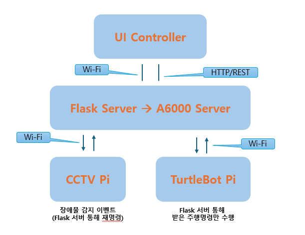

# 모바일 로봇 VLA 자율주행 시뮬레이션 프로젝트

## 목차
1. [개발 개요](#개발-개요)
2. [개발 환경](#개발-환경)
3. [시스템 아키텍처](#시스템-아키텍처)
4. [통신 및 제어 흐름](#통신-및-제어-흐름)
5. [일정 계획 (Gantt 차트)](#일정-계획-gantt-차트)
6. [단계별 개발 계획](#단계별-개발-계획)
7. [시뮬레이션 완료 목표](#시뮬레이션-완료-목표)
8. [향후 계획](#향후-계획)
9. [사용 툴 및 패키지](#사용-툴-및-패키지)
10. [기존 논문 대비 개선점](#기존-논문-대비-개선점)
11. [참고문헌 & 논문](#참고문헌--논문)

---

## 개발 개요

- **목적**: A6000 서버에서 VLA(ALOHA) 모델로 장애물을 감지하고, 내부 Wi-Fi를 통해 Pi 장치에 명령을 전달하여 실시간 경로 재탐색 구현  
- **기술 범위**: ROS2 Humble, Gazebo/RViz2, Flask, OpenCV, ALOHA

## 개발 환경

| 구성 요소                 | 사양 / OS                   |
| ------------------------- | --------------------------- |
| **A6000 서버**           | Ubuntu 22.04 LTS, RTX 4080   |
| **Raspberry Pi 4 (CCTV)** | Ubuntu 22.04 LTS            |
| **Raspberry Pi 4 (TurtleBot)** | Ubuntu 22.04 LTS Server  |
| **네트워크**             | 내부 Wi-Fi (Flask 호스팅)    |

## 시스템 아키텍처

- **UI Controller**: 웹/앱에서 목적지 선택  
- **Flask Server**: HTTP/REST API 및 Pi 간 메시지 중계  
- **A6000 Server**: ALOHA 모델 추론 및 연산  
- **CCTV Pi**: OpenCV + ALOHA 장애물 감지  
- **TurtleBot Pi**: ROS2 Nav2 자율 주행 및 재탐색  

## 통신 및 제어 흐름

1. **UI → Flask**: 목적지 전송 (HTTP/REST)  
2. **Flask → TurtleBot Pi**: 주행 시작 (ROS2 토픽)  
3. **CCTV Pi → Flask**: 장애물 감지 이벤트 전송  
4. **Flask → TurtleBot Pi**: 경로 재탐색 명령 전송  
5. **TurtleBot Pi → Flask → UI**: 상태 보고  

## 일정 계획 (Gantt 차트)

| 작업 항목                           | 시작일       | 종료일       |
| --------------------------------- | ------------ | ------------ |
| 환경 구축 (ROS2 Humble 설치)       | 2025-07-01   | 2025-07-03   |
| 시뮬레이션 환경 구축 (ROS2)         | 2025-07-04   | 2025-07-07   |
| 통신 모듈 개발 (Flask API)          | 2025-07-08   | 2025-07-12   |
| VLA 모델 로드 및 테스트            | 2025-07-13   | 2025-07-17   |
| 장애물 감지 로직 구현 (CCTV)        | 2025-07-18   | 2025-07-21   |
| 경로 재탐색 알고리즘 적용           | 2025-07-22   | 2025-07-26   |
| 최종 통합 테스트 및 분석           | 2025-07-27   | 2025-07-31   |

## 단계별 개발 계획

1. **환경 구축**
   - ROS2 Humble 설치 및 설정  
   - 네트워크 구성, 의존성 패키지 설치  
2. **Flask API 개발**
   - 목적지 전송, 장애물 이벤트 엔드포인트 구현  
3. **VLA 모델 검증**
   - ALOHA 모델 다운로드·연동, 추론 테스트  
4. **시뮬레이션 세팅**
   - Gazebo/RViz2에서 로봇 및 장애물 배치  
5. **장애물 감지 로직**
   - CCTV Pi에서 OpenCV + ALOHA로 감지 및 이벤트 전송  
6. **경로 재탐색**
   - ROS2 Nav2 실시간 좌표 업데이트 (토픽 사용)  
7. **통합 테스트**
   - 전체 플로우 시뮬레이션, 성능 지표 검증  

## 시뮬레이션 완료 목표

- **정상 주행**: 지정 목적지까지 장애물 없이 주행  
- **장애물 대응**: 감지 후 5초 이내 재탐색 시작  
- **성능**: 응답 시간 < 200ms, 재탐색 성공률 ≥ 95%  

## 향후 계획

- 실제 하드웨어 환경 검증 및 튜닝  
- 시뮬레이션 파라미터 최적화, 자동화 스크립트 추가  

## 사용 툴 및 패키지

- ROS2 Humble, Nav2  
- Gazebo, RViz2  
- Python 3.8+  
- Flask 2.x  
- OpenCV 4.x, PyTorch/TensorFlow  

## 기존 논문 대비 개선점

| 항목                | 기존 논문                                                      | 본 프로젝트 개선점                                                   |
|--------------------|--------------------------------------------------------------|---------------------------------------------------------------------|
| **Fusion 방식**      | LiDAR+Vision을 단일 모달 연결(주로 후처리 단계)               | VLA(ALOHA) 모델로 시각·LiDAR 데이터를 실시간 융합하여 직접 이벤트 검출 |
| **제어 인터페이스**   | 주로 C++ 노드간 Publish/Subscribe                            | 자연어(LLM) 연동 & Flask를 통한 REST 제어 → 토픽 퍼블리시로 분리된 UI   |
| **재탐색 속도**      | 장애물 발견 후 전체 경로 재계산                                | 부분 경로 재탐색(‘partial_replan’) + 사전 맵 활용으로 지연 대폭 감소     |
| **확장성**           | 단일 장치(서버 또는 로봇) 중심                                 | 분산 구조(A6000 서버 ↔ Pi들)로 부하 분산, 멀티-CCTV/멀티-로봇 확장 가능 |

## 참고문헌 & 논문

- Kim et al. “Visual-LiDAR Association for Autonomous Navigation”, IEEE RA-L, 2024.  
- Park et al. “ALOHA: A Visual-LiDAR Fusion Model”, ICRA 2023.  

**#ROS2 #VLA #AutonomousDriving #Gazebo #RViz #Flask #OpenCV #ALOHA**
